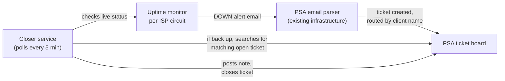

# ISP Monitoring

## The problem

MSPs monitors ISP uptime for clients as part of managed services. At one of the MSPs I worked for, the original setup pinged each client's circuit using a monitor tied to a device record inside an RMM platform, and that device record was what told the system which client the alert belonged to.

The problem showed up during routine offboarding. When a device tied to a monitor got retired, the monitor lost its routing along with it, and it stopped generating tickets entirely. Nobody found out until a client called asking why their internet had been down for an hour with no ticket and no page. For a client on a 24x7 SLA, that's not a minor gap, that's the exact failure the monitoring exists to prevent.

The fix needed two things: a way to monitor uptime that didn't depend on a device's lifecycle, and a way to make sure tickets actually closed themselves once the outage was over, so a flapping connection couldn't keep generating tickets and paging on-call with nobody ever marking anything resolved.

## What this is

Two pieces working together, documented separately because they're genuinely different kinds of work:

**[Automation](automation/)** — the monitoring and ticketing setup. A dedicated uptime tool watches each client's circuit independently of any device record, and an existing PSA email parser turns outage alerts into tickets automatically, routed to the right client by a naming convention rather than hardware association.

**[TypeScript](typescript/)** — the piece that didn't exist in any off-the-shelf tool. Once a ticket opens automatically, something still has to notice when the circuit recovers and close it. That's a small service that polls the monitoring tool's API, checks against the PSA for a matching open ticket, and closes it with a note explaining what happened.

## How it fits together

Nothing in this flow talks to anything else directly. The monitor doesn't know about the PSA, the PSA's parser doesn't know about the closer service, and the closer service doesn't create tickets, only closes them. The only thing holding it together is that all three pieces use the exact same naming convention for a given client and circuit: `[Company: CompanyID | ISP Name]`. That string is the monitor's name, the alert email's subject line, and the ticket's summary, all identical, which means the closer service can search the PSA for a ticket using nothing but the monitor's own name, no shared database or lookup table required.

## Rolling out to a new client

No code changes. Three steps, all configuration:

1. Create a monitor for the client's ISP circuit using the `[Company: CompanyID | ISP Name]` naming convention.
2. Add a matching parsing rule in the PSA's email connector so the alert routes to the right client, board, and priority.
3. Nothing else. The closer service already polls every monitor on the account and picks up new ones automatically on the next cycle.

Full detail on both pieces, including the specific gotchas that came up building this (permission scoping, API formatting quirks, a state-tracking approach that had to be abandoned), is in [`automation/`](automation/) and [`typescript/`](typescript/).

## A note on scope

This system closes tickets, it doesn't fix outages. When a circuit goes down, nothing here brings it back up faster, and when a speed test comes back slow, nothing here increases bandwidth. What's automated is the administrative loop around a real-world event: alert when something breaks, confirm and document when it's resolved. The actual fix, if one's needed, is still a human troubleshooting a real circuit.
